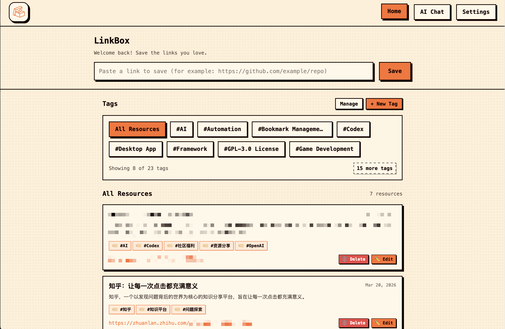
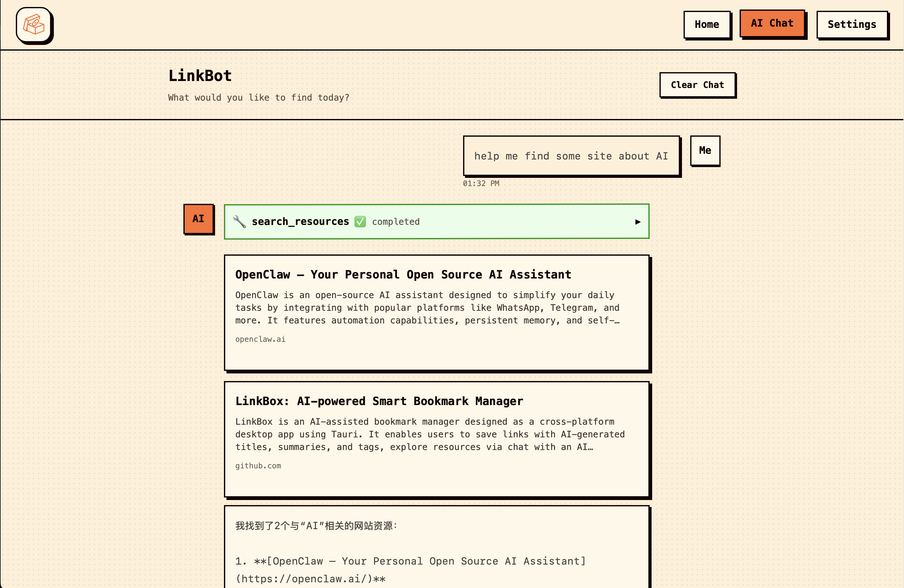

<div align="center">
  
  <h1>LinkBox</h1>
  <p><a href="./README.md">English</a> | 中文</p>
</div>

LinkBox 是一个 AI 辅助的链接收藏工具，目前已经打包为基于 Tauri 的跨平台桌面应用。项目由 React 前端、FastAPI 后端和 Python sidecar 组成，可分发到 macOS、Windows 和 Linux。

## 界面预览

<p align="center">
  
  
</p>

## 功能特点

- 收藏链接时自动生成标题、摘要和标签
- 按标签浏览和管理本地资源库
- 通过 AI 助手对话检索或整理收藏内容
- 默认使用本地单用户模式
- 通过 Tauri 生成桌面安装包
- 前端支持简体中文和英文切换


## 安装

🍎MacOS:  

打开软件前请先在终端执行命令
```
sudo xattr -cr /Applications/LinkBox.app/
```

## 技术栈

- 前端：React 19、TypeScript、Vite、Tailwind CSS、Framer Motion
- 桌面壳：Tauri v2
- 后端：FastAPI、SQLAlchemy、Pydantic
- AI 集成：兼容 OpenAI 风格接口，使用 `openai`、`langchain`、`langchain-openai`
- 数据库：默认 SQLite，也支持通过环境变量切换到 MySQL

## 目录结构

```text
.
├── web/          # React 前端
├── server/       # FastAPI 后端
├── src-tauri/    # Tauri 桌面壳
├── scripts/      # 构建辅助脚本，包括 sidecar 打包
└── .github/      # CI/CD 工作流
```

## 环境要求

- Node.js 20+
- 建议使用 Python 3.13
- Rust stable toolchain

如果要在 Linux 上构建桌面包，还需要安装 Tauri 常见系统依赖，例如 `libwebkit2gtk`、`libappindicator`、`librsvg`、`patchelf`。


## 本地开发

安装依赖：

```bash
npm ci
npm ci --prefix web
python3 -m venv .venv-desktop
.venv-desktop/bin/pip install -r server/requirements.txt pyinstaller
```

启动桌面开发模式：

```bash
npm run tauri:dev
```

这个命令会同时完成：

- 启动前端 Vite 开发服务器
- 启动 Tauri 桌面壳
- 由桌面程序自动拉起 Python 后端

## 本地打包

先构建 Python sidecar：

```bash
npm run build:sidecar
```

`build:sidecar` 现在会生成供 Tauri 作为资源打包的 `onedir` sidecar。
它会刷新 `src-tauri/resources/sidecar/` 下的资源 sidecar。

再构建桌面包：

```bash
npm run tauri:build
```

当前产物目标：

- macOS：`dmg`
- Windows：`nsis`、`msi`
- Linux：`AppImage`、`deb`

## CI/CD 发布流程

项目已经配置 GitHub Actions 自动构建桌面版本。

工作流文件：

- [.github/workflows/release.yml](./.github/workflows/release.yml)

触发方式：

- 推送类似 `v0.1.0` 的 tag
- 在 GitHub Actions 中手动执行并传入 `release_tag`

工作流会：

- 安装 Node、Python、Rust
- 通过 `scripts/build_sidecar.py` 构建 Python sidecar
- 为三个平台构建 Tauri 安装包
- 自动上传到 GitHub Releases

## 说明

- 桌面应用在存在 bundled sidecar 时会优先使用它
- 桌面模式下后端默认监听 `127.0.0.1`
- AI 配置可在设置页修改，并保存在本地数据库中
- 当前 Release 流程生成的是未签名产物；后续可以继续补 macOS notarization 和 Windows 代码签名

## 版本说明

本文档对应当前 `v0.1.x` 桌面 MVP 版本。
